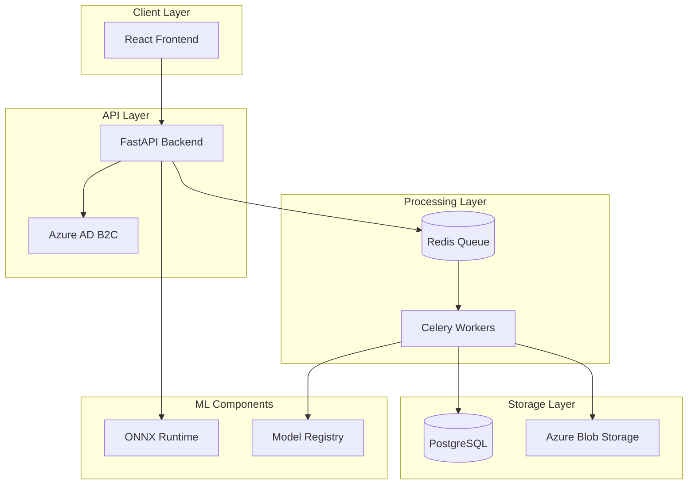

# Shadow Hubble - Fraud Detection MLOps Platform

[](https://azure.microsoft.com)
[](https://python.org)
[](https://react.dev)
[](LICENSE)

---

An enterprise-grade MLOps platform for automated fraud detection, featuring real-time model monitoring, bias detection, and seamless Azure deployment.

## 🚀 Key Features

### 🧠 ML Lifecycle Management
*   **Automated Training**: XGBoost, LightGBM, and Random Forest with hyperparameter optimization.
*   **Feature Engineering**: 50+ temporal, velocity, and statistical features.
*   **High-Performance Inference**: ONNX runtime providing <10ms latency.
*   **Explainability**: SHAP integration for local and global feature importance.

### 📈 Monitoring & Governance
*   **Real-time Drift Detection**: PSI and KS-test monitoring on production data.
*   **Bias & Fairness**: Fairlearn integration for parity metric evaluation.
*   **Model Registry**: Full version control with champion-challenger (A/B) workflows.
*   **Auto-Retraining**: Triggered by drift or performance degradation.

### 🛡️ Enterprise Security
*   **RBAC**: Granular role-based access control (Admin, MLE, DS, Analyst, Viewer).
*   **Audit Logging**: Comprehensive tracking of all platform actions.
*   **Security**: Azure AD B2C integration and rate limiting.

## 🏗️ System Architecture



## 📁 Project Structure

```text
├── backend/               # FastAPI + SQLAlchemy + Celery
├── frontend/              # React 18 + TypeScript + Vite
├── infrastructure/        # Terraform for Azure Cloud
├── ml/                    # Feature engineering & Model trainers
└── docs/                  # Technical documentation
```

## 🛠️ Quick Start

### Local Setup (Docker)
```bash
git clone https://github.com/mayur0522/fraud-detection-mlops-platform.git
cd fraud-detection-mlops-platform
docker-compose up -d --build
```
*   **API**: `http://localhost:8000/api/docs`
*   **UI**: `http://localhost:3000`

### Cloud Deployment (Terraform)
```bash
cd infrastructure/terraform
terraform init
terraform apply -var="environment=prod"
```

## 📊 Technology Stack

| Category | Technologies |
| :--- | :--- |
| **Backend** | Python 3.11, FastAPI, Celery, Redis, PostgreSQL |
| **Frontend** | React, TypeScript, Ant Design, React Query |
| **ML/DS** | Scikit-learn, XGBoost, ONNX, SHAP, Fairlearn |
| **Cloud/DevOps** | Azure, Terraform, Docker, GitHub Actions |

## 📄 License

MIT License - see [LICENSE](LICENSE) for details.